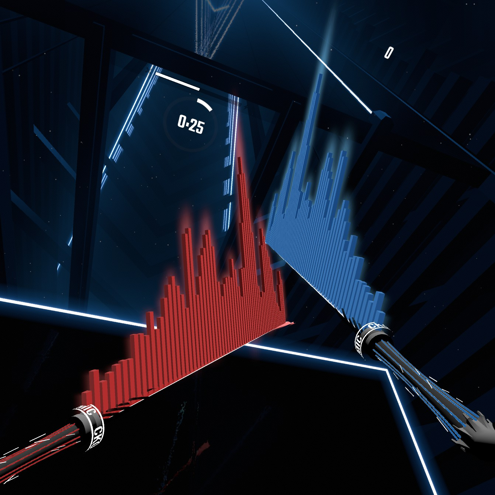

# SpectroSaber
 \
SpectroSaber is a mod for Beat Saber that adds spectrograms (music visualizers) to your sabers.

## Installation

- Install SiraUtil, BeatSaberMarkupLanguage, and BS Utils via ModAssistant or elsewhere
- Place [SpectroSaber.dll](https://github.com/ckosmic/SpectroSaber/releases) in the Beat Saber Plugins folder

## Features

- Adjustable transparency to limit distraction
- Adjustable intensity
- Colors match sabers even in Chroma-compatible levels
- Looks super cool